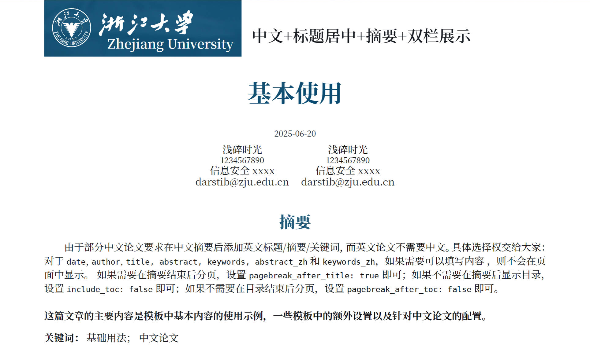
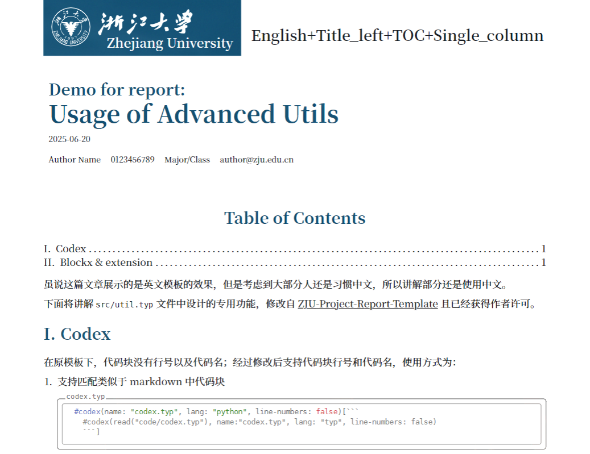

# Typst-ZJU-template

这个仓库是修改自 [graceful-genetics](https://github.com/jamesrswift/graceful-genetics)、面向浙江大学[^1] 的课程论文/报告的 typst 模板，灵感来自 [@ArriettyCh](https://github.com/ArriettyCh)。

[^1]: 其实改改就能用在其他学校和其他场景。

> 如果更喜欢传统的纯黑白的报告，可以参考 [ZJU-Project-Report-Template](https://github.com/memset0/ZJU-Project-Report-Template) 。

[toc]

## 模板介绍

在 `example/*.typ` 中给出了常见的两种使用场景：课程论文和实验报告。他们的导出 PDF 存放在 `docs/*.pdf` 中。

但是实际上支持更加丰富的自由组合：

- 语言：中文（zh）或英文（en）；
- 作者：单人或多人
- 标题对齐方式：居中（center）或左对齐（left）；
- 摘要：中英文摘要；
- 关键词：中英文关键词；
- 目录：是否包含目录；
- 列数：单栏（1）或双栏（2）；
- 其他：如日期、课程名称等。

### paper-demo

在 paper-demo 中展示了中文、标题居中、有摘要、双栏下的效果，以及其他常用功能的处理；



### report-demo

在 report-demo 中展示了英文、标题左对齐、有目录、单栏下的效果，以及 `src/util.typ` 中实现的额外功能。



对于其他推荐的小组件，参考 [Typst_begin - 推荐资料](https://darstib.github.io/blog/tutorial/begin/Typst_begin/#%E6%8E%A8%E8%8D%90%E8%B5%84%E6%96%99) 。

## 开始使用

从 lib.typ 中导入 `template`，然后使用 `template.with(...)` 来设置模板的各个部分；默认内容如下（这些内容与在文章中的【自上而下】顺序一致）：

```typst
#import "../src/lib.typ": *

#show: template.with(
  language: "en", // 语言，默认 "en"，可选 "zh"（中文）
  course: [course name], // 课程名称，即第一个页面右上角的内容，可能需要使用 `#text(size: xxpt)[course name]` 来调整大小
  title: [Article title], // 文章标题
  title_align: "center", // 标题对齐方式，"center" 或 "left"，默认居中
  date: [], // 日期，默认无，datetime.today() 为当前日期
  authors: (
    (
      name: "",
      id: "",
      institution: "",
      mail: "",
    ), // 作者信息，name 为姓名，id 为学号，institution 为学院/研究所，mail 为邮箱
  ), // 可以设置多组信息；一组则横向排列，多组则纵向排列
  abstract_zh: [], // 中文摘要，默认为空
  keywords_zh: (), // 中文关键词，默认为空
  title_en: [], // 英文标题（如果中文论文需要英文标题），默认为空
  abstract: [], // 英文摘要，默认为空
  keywords: (), // 英文关键词，默认为空
  pagebreak_after_title: false, // 摘要后是否分页，默认 false
  include_toc: true, // 是否包含目录，默认为 true
  pagebreak_after_toc: true, // 目录后（确切说是正文内容前）是否分页，默认 true
  columns: 1, // 列数，默认 1，一般为 1 或 2
)

// 中英文混用问题
#let bib_file = "refs.bib"
#if (bib_file != none) {
  if (language == "zh") {
    bilingual-bibliography(bibliography: bibliography.with(bib_file))
  } else {
    bibliography(bib_file)
  }
}
```

一般来说，我们必须要修改的是 `course`、`title`、`authors`，其余部分按照解释选择是否设置即可。

## Markdown to Typst

一般来说我还是习惯于用 markdown 先写基本的内容，然后再转换为 typst 进行排版。Pandoc 是一个很好的工具，可以用来进行转换；但是支持的内容有限，所以希望借助 LLM 的能力来处理这些重复性极强的转换工作。

为此，我设计了 `md2typ/markdown.md` 提示词，在 [Gemini 2.5-Flash](https://aistudio.google.com/) [^2]中放入系统提示词部分即可。目前使用多次，表现良好，一般最后只需要调整调整 template 部分和数学公式即可。

[^2]: 为什么不使用 2.5-Pro？因为 2.5-Flash 更加听从指令，在我测试的内容上表现更好；2.5-pro 思维过于活跃了。